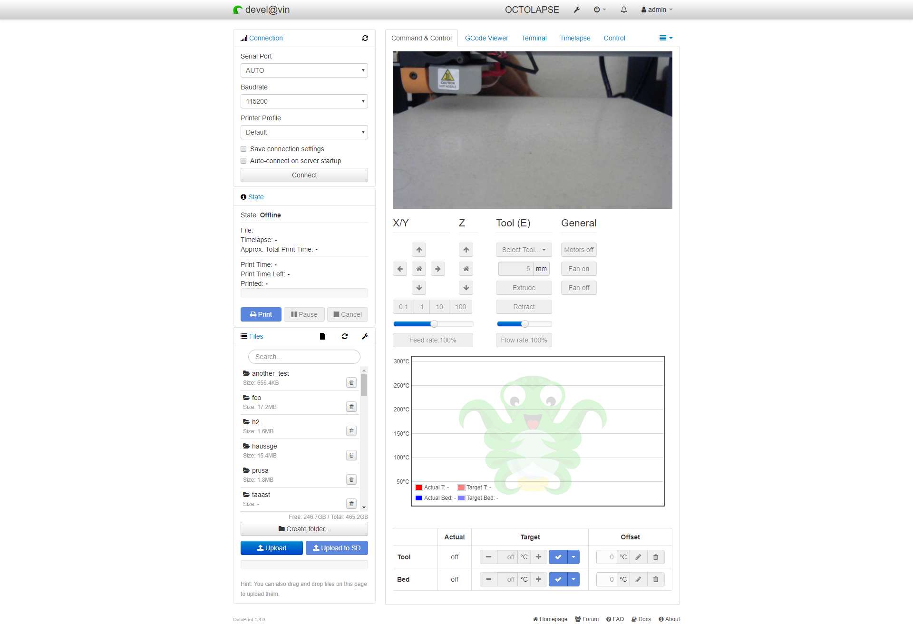

# Consolidate Temp Control

Based on foosel's original [Proof of Concept](https://github.com/foosel/OctoPrint-ConsolidateTempControl/), this plugin consolidates the temperature and control tabs into one. Modifications to foosel's original source includes making the overall UI more compatible with widescreen displays and puts the temperature and control tabs next to each other instead of stacked on top of each other. Also implemented hack to hide original Temperature and Control tabs from view.

## Known Issues
  - Occasionaly the webcam stream isn't detected.  Swapping tabs or refreshing the page usually brings it back.

## Setup

Install via the bundled [Plugin Manager](https://github.com/foosel/OctoPrint/wiki/Plugin:-Plugin-Manager)
or manually using this URL:

    https://github.com/jneilliii/OctoPrint-ConsolidateTempControl/archive/master.zip
	
## Get Help

If you experience issues with this plugin or need assistance please use the issue tracker by clicking issues above.

### Additional Plugins

Check out my other plugins [here](https://plugins.octoprint.org/by_author/#jneilliii)

### Support My Efforts
I, jneilliii, programmed this plugin for fun and do my best effort to support those that have issues with it, please return the favor and leave me a tip if you find this plugin helpful.

<small>No paypal.me? Send funds via PayPal to jneilliii&#64;gmail&#46;com</small>
